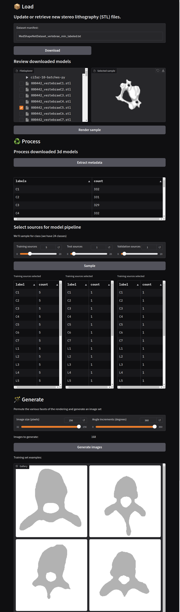

# Shaperx AIPI 540 Project #1

[MedshapeNet Reference](https://arxiv.org/abs/2308.16139)

[Hosted Gradio App Location](https://851e2f3ca2ecd38233.gradio.live)

This project utilizes the MedShapeNet database to develop and evaluate a machine learning classifier, a naïve approach, a deep learning and non-deep learning model for medical shape classification. All data used in this study are de-identified and publicly available, ensuring the privacy and confidentiality of individuals are protected. MedShapeNet database is distributed under the Creative Commons Attribution 4.0 International (CC BY 4.0) license. 

Problem Statement: This project aims to develop a model using Medshapenet vertebrae data to classify medical images into a set of pre-defined medical categories, comparing the performance of a naive, non-deep learning model, and a deep learning model (e.g., Convolutional Neural Network). Accurate, unbiased classification is integral in determining diagnosis and pathology, and may be useful in terms of allocating resources and advocating for next-step treatment options.

**Theme**: Health, wellness and fitness

## Design

### Naive Classifier

1. Naive approach : B&w histograms?
   
### Traditional ML Pipeline (support vector machine)

This dataset contains the following scripts to support the traditional ml pipeline:

### Deep Learning Pipeline (Convolutional Neural Network)

Neural-network-based approach : PyTorch-based convolutional neural network (CNN)
     
svm_model_train.py:

### Development

For dependencies, see [requirements](requirements.txt). 

If working on the UI, run in gradio development mode: 

`gradio app/app.py`

⚡ The app expects to be run from the root of the repo, not the app directory. Mostly because we have the 'data' directory hardcoded.

### Testing 

TODO

### Deployment

The model can be demonstrated by deploying the included gradio application. 

1. cd <repo>/app
2. python app.py 
3. point browser at http://127.0.0.1:7860

### Interface 

The Gradio app allows the user to walk through the model pipeline, from downloading 3d models through classification and validation. 

### Usage 

### Evaluation

    # Figure 1 Confusion Matrix - Validation Set - Traditional ML Model

    # Figure 2 Classification Report - Validation Set - Non - Deep Learning Model

    # Figure 3 Classification Report - Test Set - Deep Learning Model

## Metric

While the precision and recall of individual classes is a useful metric for debugging our classification operation, we assess that the user really cares about overall *accuracy*. That is, the total number of correctly vs incorrectly classifed images. This metric is intuitive and concise in the context of vertebrae classification . 

### Results

### Conclusion

### Outstanding Issues 

- ❗ a number of files are not loading into the mesh, warning printed is shown below. for now we are ignoring, but we should process the whole dataset to remove these and then resample, otherwise we'll have unintended class imbalance
  > [Open3D WARNING] Unable to load file data/001200_vertebrae.stl with ASSIMP: Unable to open file "data/001200_vertebrae.stl".
- ❗ we aren't inducing any scale or lighting changes in our images, remedy that! (?)
- fix NN training, it's not converging 
- validate SVM training and classification 
- implement naive method 
- write a test routine that compares the three for a subset of data
- add a panel to the UI that overlays the classification on the image or adds a figure subtitle 

- testing - use experiment 25, training for real, use 22 
